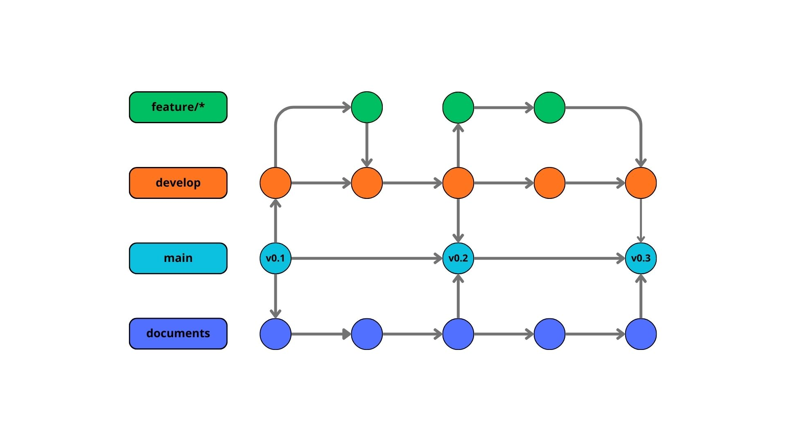

# Visão Geral
Projeto de criação de um RPG em python

[Brainstorm do projeto no canva](https://www.canva.com/design/DAGzPbYH7wQ/J6XXYxe3BEQWRxS2OEKW9g/edit?utm_content=DAGzPbYH7wQ&utm_campaign=designshare&utm_medium=link2&utm_source=sharebutton)

- Gênero: RPG Clássico
- Tema: Fantasia
- Loop de Gameplay: explorar o mapa -> lutar com inimigos -> coletar itens -> evoluir o personagem
- Ambientação: [Floresta corrompida](./assets/ambiente_1.png)
- Sistema de luta de acordo com as classes:
	- Guerreiro: Espada
	- Arqueiro: Arco
- Itens coletáveis: 
	- Moeda (drop) (sem utilidade inicialmente)
	- Minério (drop) (para construção de espadas)
	- Fibra de seda (drop) (para a construção de um arco)
	- Acessório (drop) (buff de defesa para jogador)
	- Couro especial (drop) (para a construção de uma armadura)
- Evolução do personagem:
	- 5 Níveis
	- Itens melhores são craftáveis com os drops
- Esboço de elementos visuais:
	- [Inventário](./assets/Inventario.png)
	- Craft
	- HUD

# GitFlow

Para melhor organização do projeto, será utilizado o seguinte GitFlow:

## Main
- A main será branch principal em que o código mais estável e devidamente versionado estará. A partir dela serão criadas as branchs develop e documents.

## Develop 
- A develop é a branch base de desenvolvimento e integração das features.

## Documents
- A documents é a branch em que tudo que não faz parte da codificação diretamente estará, como padrões de uso e esboços do projeto.

## Feature
- São criadas para o desenvolvimento das tarefas do projeto.
- Padrão lexico: feature/[nome_da_feature]

# Padrões de Uso do GitHub

Para melhor organização e estética do GitHub, será utilizado o seguinte padrão de uso:

## Commit
- Os commit serão feitos seguindo os modelos abaixo:
	- :sparkles: feat: título da feature
	- :books: docs: título do documento ou descriçaõ da atualização realizada no documento
	- :recycle: refactor: descrição da refatoração
	- :bug: fix: bug corrigido